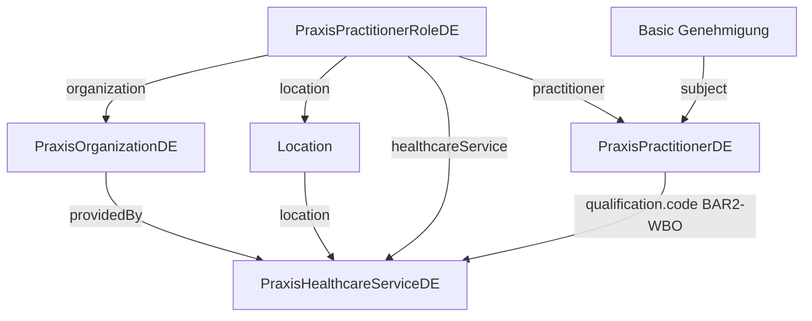

# HealthcareService Contract

This page defines the canonical ambulatory `HealthcareService` contract for fhir-praxis-de.
Profile decision: see [ADR-007](https://github.com/cognovis/fhir-praxis-de/blob/main/docs/adr/ADR-007-healthcare-service-isik-alignment.md).

## Profile Decision Summary

fhir-praxis-de does **not** inherit `ISiKMedizinischeBehandlungseinheit` directly because the
`de.gematik.isik-terminplanung` package is not resolvable from the public FHIR package registry.
Instead, this IG publishes **`PraxisHealthcareServiceDE`**, structurally aligned with ISiK Stufe 5
cardinalities. Hospital ISiK consumers treat
`https://gematik.de/fhir/isik/StructureDefinition/ISiKMedizinischeBehandlungseinheit` as the
compatibility mapping target.

| Resource | Canonical URL |
|----------|---------------|
| Profile | `https://fhir.cognovis.de/praxis/StructureDefinition/praxis-healthcare-service-de` |
| Type ValueSet | `https://fhir.cognovis.de/praxis/ValueSet/praxis-healthcare-service-type` |
| Type CodeSystem | `https://fhir.cognovis.de/praxis/CodeSystem/praxis-healthcare-service-type` |
| Specialty ValueSet | `https://fhir.cognovis.de/praxis/ValueSet/praxis-healthcare-service-specialty` |
| Specialty external CS | `https://fhir.kbv.de/CodeSystem/KBV_CS_SFHIR_BAR2_WBO` |
| ISiK compatibility target | `https://gematik.de/fhir/isik/StructureDefinition/ISiKMedizinischeBehandlungseinheit` |

## Field Requirements

| Element | Cardinality | Must Support | Notes |
|---------|-------------|--------------|-------|
| `active` | 1..1 | yes | Service offering availability |
| `name` | 1..1 | yes | Human-readable offering label |
| `identifier` | 0..* | yes | Business ids for downstream sync |
| `providedBy` | 1..1 | yes | Reference(`PraxisOrganizationDE`) |
| `location` | 0..* | yes | Reference(`Location`) — shared sites link multiple offerings |
| `type` | 1..* | yes | Bound extensible to `PraxisHealthcareServiceTypeVS` |
| `specialty` | 1..* | yes | Bound extensible to `PraxisHealthcareServiceSpecialtyVS` (KBV BAR2-WBO) |

### Organization

`providedBy` MUST reference a `PraxisOrganizationDE` instance. This anchors the offering to the
practice organization responsible for billing, configuration, and staff assignment.

### Location

`location` references base FHIR `Location` resources. Co-located offerings (e.g. general medicine
and radiology at one MVZ site) share the same `Location` reference. `PractitionerRole.location`
SHOULD align with the same `Location` when the role serves that site.

### Specialty and Type

- **`type`**: PVS-agnostic service category (`general-practice`, `internal-medicine`, `radiology`,
  `psychosomatic-basic-care`). Do **not** use `GenehmigungenLeistungsbereichCS` codes on
  `HealthcareService.type`.
- **`specialty`**: Ambulatory Fachgruppe via KBV BAR2-WBO (`PraxisHealthcareServiceSpecialtyVS`).

### Active / Status

Only `active` is constrained (boolean, mandatory). There is no separate operational status element
beyond base FHIR `HealthcareService.active`.

### Identifiers

Systems SHOULD provide at least one stable business identifier (e.g.
`https://fhir.cognovis.de/praxis/NamingSystem/service-offering-id`). BSNR on the organization
covers Betriebsstaette identity; service-offering identifiers distinguish multiple offerings under
one organization.

### Provenance

This profile does not add provenance elements. AI or configuration provenance for published
offerings uses base `Provenance` resources per [Proposal Provenance](proposal-provenance.html)
when applicable.

## Resource Relationships



### PractitionerRole link

`PraxisPractitionerRoleDE.healthcareService` references `PraxisHealthcareServiceDE` (0..* MS).
Use this to connect staff roles to publishable service offerings.

### Qualification vs Genehmigung vs Service offering

| Concern | FHIR element | Terminology |
|---------|--------------|-------------|
| Formal qualification | `Practitioner.qualification.code` | KBV BAR2-WBO |
| KV authorization evidence | `Basic` + `GenehmigungenExt` | `GenehmigungenLeistungsbereichVS` |
| Published service offering | `HealthcareService` | `PraxisHealthcareServiceTypeVS` + `PraxisHealthcareServiceSpecialtyVS` |

Genehmigung `leistungsbereich` codes (e.g. `psychosomatik-grundversorgung`) evidence authorization;
they are **not** copied to `HealthcareService.type`. Align offerings to Genehmigung via shared
BAR2-WBO specialty and practitioner subject linkage.

### Shared-location example

`ExampleSharedPracticeLocation` is referenced by:

- `ExampleHealthcareServiceGeneral` and `ExampleHealthcareServiceRadiology` (same `providedBy`
  organization `ExamplePraxisOrganizationHs`)
- `ExamplePractitionerRoleGeneral` and `ExamplePractitionerRoleRadiology` (each links its
  `healthcareService` and `location`)

Psychosomatic scenario (`ExampleHealthcareServicePsychosomatik`) adds
`ExampleGenehmigungPsychosomatik` on `ExamplePractitionerPsychosomatik` with
`leistungsbereich` = `psychosomatik-grundversorgung`.

## ISiK / IHE Specialty Mapping

ISiK `ISiKMedizinischeBehandlungseinheit` binds `specialty` to IHE XDS practice setting
(`http://ihe-d.de/ValueSets/IHEXDSpracticeSettingCode`). fhir-praxis-de uses KBV BAR2-WBO for
ambulatory Fachgruppe. When exchanging with ISiK hospital systems, add IHE coding alongside KBV
or apply this mapping at the integration boundary:

| KBV BAR2-WBO | Display (DE) | Suggested IHE practice setting |
|--------------|--------------|--------------------------------|
| `010` | Allgemeinmedizin | General Medicine |
| `050` | Radiologie | Radiology |
| `080` | Psychosomatische Medizin und Psychotherapie | Psychiatric/Mental Health |

Exact IHE codes depend on the target ISiK implementation; consult the hospital ValueSet expansion.

## Downstream Handoff


### Mandatory profile URL

```
https://fhir.cognovis.de/praxis/StructureDefinition/praxis-healthcare-service-de
```

### Mandatory ValueSet URLs

| Purpose | URL |
|---------|-----|
| `HealthcareService.type` | `https://fhir.cognovis.de/praxis/ValueSet/praxis-healthcare-service-type` |
| `HealthcareService.specialty` | `https://fhir.cognovis.de/praxis/ValueSet/praxis-healthcare-service-specialty` |
| Practitioner qualification / specialty alignment | `https://fhir.kbv.de/ValueSet/KBV_VS_SFHIR_BAR2_WBO` |
| Genehmigung evidence (Basic only) | `https://fhir.cognovis.de/praxis/ValueSet/genehmigung-leistungsbereich` |

### Mandatory mapping rules

1. **Publish offerings** as `HealthcareService` instances conforming to `PraxisHealthcareServiceDE`.
2. **Set `type`** from `PraxisHealthcareServiceTypeCS` — never from Genehmigung leistungsbereich codes.
3. **Set `specialty`** from KBV BAR2-WBO (`PraxisHealthcareServiceSpecialtyVS`).
4. **Set `providedBy`** to the owning `PraxisOrganizationDE`.
5. **Link staff** via `PraxisPractitionerRoleDE.healthcareService` + `location` + `organization`.
6. **Store KV Genehmigung** on `Basic` (`BasicResourceTypeCS#genehmigung`) with `GenehmigungenExt`;
   correlate to offerings by practitioner + specialty, not by duplicating codes on `HealthcareService`.
7. **Persist `identifier`** with stable service-offering ids for idempotent downstream sync.

### PractitionerRole profile URL

```
https://fhir.cognovis.de/praxis/StructureDefinition/praxis-practitioner-role-de
```

## Examples

| Instance | Scenario |
|----------|----------|
| `ExampleHealthcareServiceGeneral` | General / primary care offering |
| `ExampleHealthcareServiceRadiology` | Radiology offering at shared location |
| `ExampleHealthcareServicePsychosomatik` | Psychosomatic basic care with Genehmigung |
| `ExampleSharedPracticeLocation` | Shared location for co-located offerings |
| `ExamplePractitionerRoleGeneral` / `ExamplePractitionerRoleRadiology` | Shared-location staff links |
| `ExampleGenehmigungPsychosomatik` | Authorization evidence separate from `type` |
